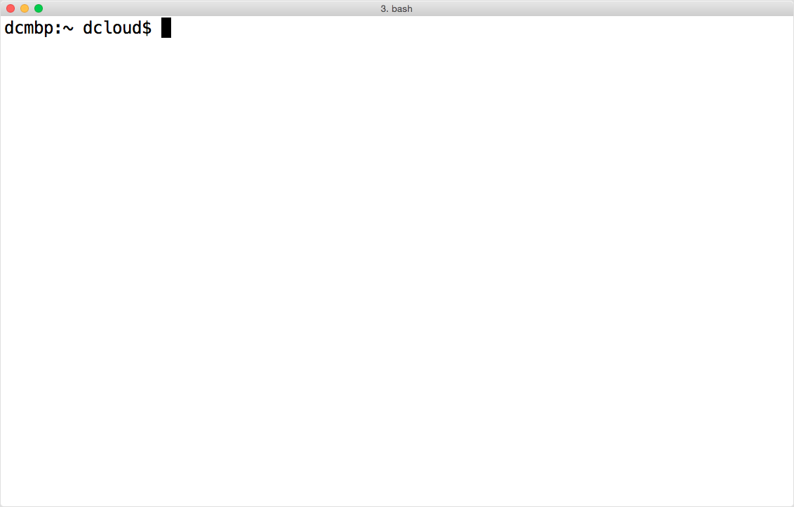
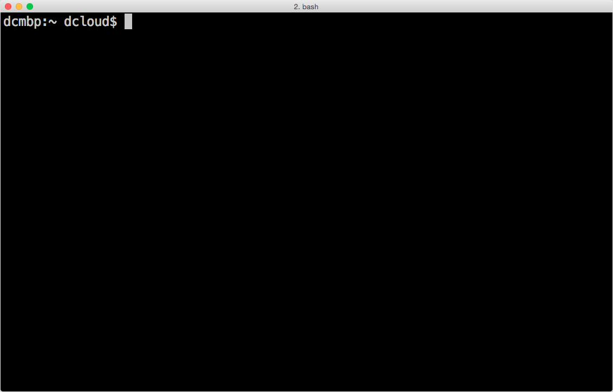

# What is the "Command line"?

If you're talked with computer programmers or "power users", you may have heard of something called [the command line](https://en.wikipedia.org/wiki/Command-line_interface). The command line is a text-based interface for working with a computer. The "command" in that phrase refers to a task or tasks that a user wants the computer to perform. Commands are similar to applications, but they typically fulfill one (or a few) small task(s) rather than large or complex tasks. On the command line, you can perform create and delete files, view the contents of a directory (folder), fetch information from the internet, and much more. You can combine multiple commands into a sequence to carry out larger, morecomplex tasks and tailor the results to your needs. This makes the command line a powerful and flexible environment for getting things done.

The command line provides a keyboard-driven method for completing tasks, including ones we have become accustomed to handling using modern graphical interfaces (GUIs). If you've ever learned the keyboard shortcuts for your operating system or an application you use frequently, you may appreciate how you can get things done more quickly using the keyboard than when switching between keyboard and mouse. If you can memorize various commands and keyboard shortcuts for the command line, you may come to appreciate the power and utility of this text-based computer interface.

## Command line, terminal, shell: which is it?

Users of the command line often use the phrases *command line*, *shell*, [*Bash*](abbr:Bourne Again Shell) and *terminal* interchangably. You may encounter the acronym [CLI](abbr:Command Line Interface) which stands for *Command Line Interface*. Essentially, a *terminal* is a [GUI](abbr:Graphical User Interface) application that provides a running *shell* which has a *command line*. *Bash* is popular *shell* implementation in the same sense that Firefox is a browser implementation. If someone asks you to "open a shell" or "open a terminal" or "go to the command line", they typically mean the same thing. We'll try to stick to the phrase *command line*.

## What does the command line look like?

If you open a terminal on a new machine, you may see a window that looks similar to this:

Your command line won't look exactly the same because the shell typically shows you two things about your computer: your computer's name and your username. In this example, *dcmbp* is the computer's _hostname_ and *dcloud* is the username. The hostname identifies a computer on a network, so this text, called a *prompt* helps you understand what user and computer this terminal is connected to. We'll touch on connecting to other computers on the command line later on.

Another item to note is the `~` (tilde) symbol, which actually means "your user's home directory". There are a few important symbols that have one or more meanings on the command line. Try to remember that `~` means "home directory": knowing that will come in handy later.

So in the image above we have a line that shows the computer's hostname, a colon as a separator, then an indication of the current working directory (you are always working in a directory when using the command line), followed by a space, then the username, and finally a dollar sign `$`. That `$` is the end of the *prompt*, an indication that the shell is waiting for user input. The `$` is the default prompt for most shells, but the prompt can be customized to look different, so this may not always be the case.

Speaking of customization, there are options for changing colors as well. Perhaps as a callback to the early days of command line computing, many programmers prefer a dark background with light text. So you may run across a command line that looks more like this:

In Mac OS X's Terminal application, the default light color theme is called "Basic" and one of the dark color theme's is called "Pro". There are many options for choosing fonts, colors and opacity as well as setting the size of the terminal window (hint: it's not the same as window resizing).

Terminal window are usually small by default since they harken back to a time when displays where fairly limited in the number of characters you could fit on one line and how many lines you could fit on oone screen at a time. The command line came before scrolling and resizing as we know it in our modern [GUI](abb: Graphics User Interface)s, so many commands you will learn depend on knowing a fixed size of columns and rows (like a grid). Resizing of terminal [GUI](abb: Graphics User Interface) windows can mess up the display of information on the command line. You have been warned.
