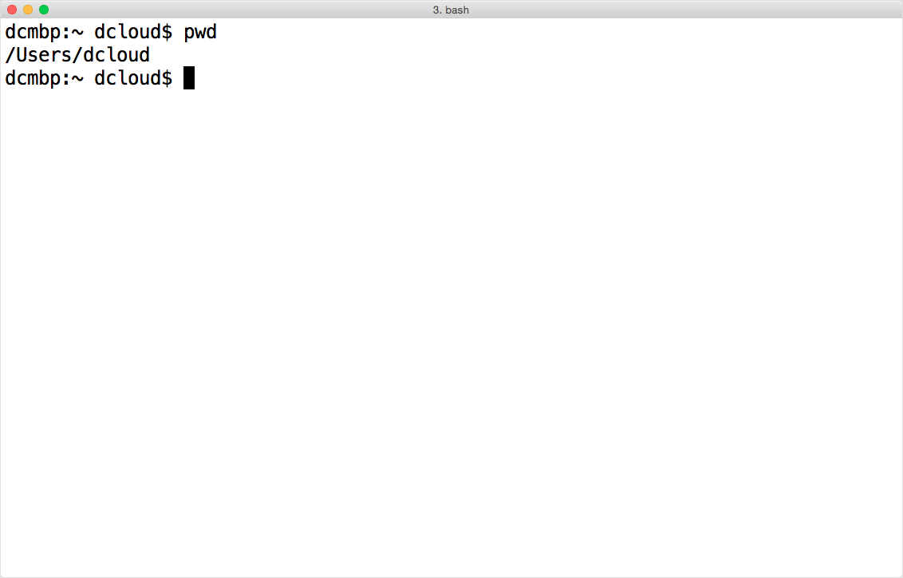
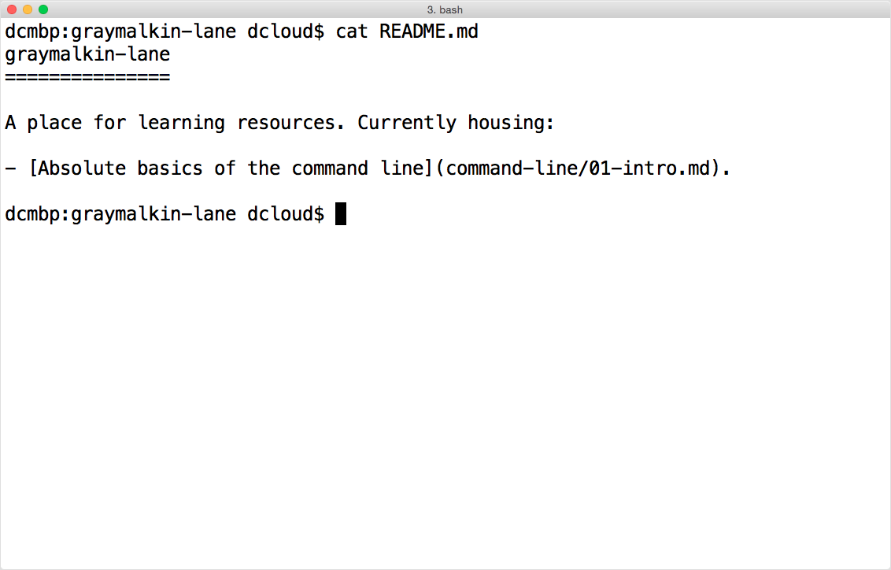

# Commands on the command line

Here are some basic commands that should get you started. One useful for learning your way around is the `man` command, which allows you to learn the syntax and options for most other commands.

## Some commands

| Command name | What it does | Example |
| ------------ | ------------ | ------- |
| ``man`` | Shows a manual page for a particular command, if available. | ``man ls`` will show you how to use the `ls` command, with options.|
| ``ls`` | **L**i**s**t files in the current directory (aka folder) or one you specify. | ``ls /`` |
| ``pwd`` | **P**rint the **w**orking **d**irectory. Your shell is always running from a directory! |
| ``cd`` | **C**hange **d**irectory. Navigate the file system on your computer. |
| ``cat`` | Con**cat**enate (link together) and print one or more files (to the terminal). Good for short documents. | ``cat 02-basic-commands.md`` |
| ``less`` | View contents of a file in your terminal, paging the contents. Good for long documents. | ``less 02-basic-commands.md`` |
| ``grep`` | Searches for a pattern in one or more files you specify. You can perform simple searches quickly using `fgrep`, but you can create more powerful search expressions using `grep`. | ``fgrep 'terminal' command-line/02-basic-commands.md`` |

## What do these commands look like?

### `man`

Using `man` to learn about the `ls` command:

### `ls`

Listing files in the present working directory:

### `pwd`

Printing the present working directory:

### `cd`

Changing the working directory to a different directory:

### `cat`

Con**cat**enating and printing a file to the terminal:

### `less`

Paging and printing a file to the terminal, using `less`:

You'll need to how to navigate in `less`. To move forward in the document you can press `f` or the *spacebar*. To go back, press `b`. To get out of this "program", press `q`. You can press `h` for *help* or read more about these shortcuts in the *man* page (run `man less` in the terminal).

### `grep`

Searching for a pattern (text, in this case) in a file. Note the `--color=auto` option to show the matches in color:

