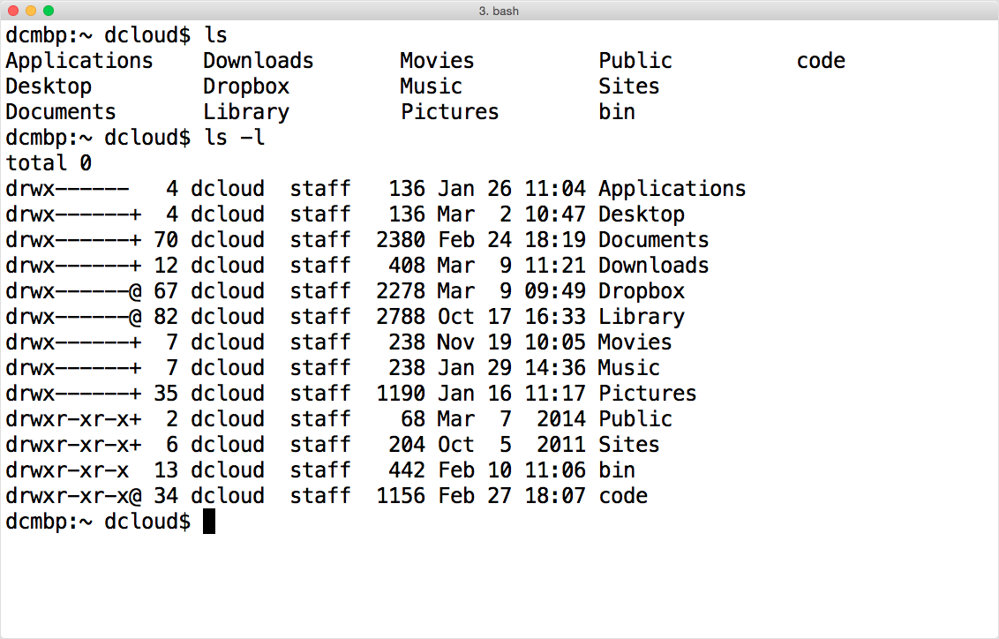

# Commands on the command line

Here are some basic commands that should get you started. One useful for learning your way around is the `man` command, which allows you to learn the syntax and options for most other commands. In the terminal, you type the name of the command you want then any options or arguments after that using spaces to separate each phrase, then press <kbd>Enter</kbd> to run the command. We'll discuss arguments and options after we see a few basic commands.

## Some commands

| Command name | What it does | Example |
| ------------ | ------------ | ------- |
| ``man`` | Shows a manual page for a particular command, if available. | ``man ls`` will show you how to use the `ls` command, with options.|
| ``ls`` | **L**i**s**t files in the current directory (aka folder) or one you specify. | ``ls /``. ``ls -la`` is very useful. See [arguments and options](#arguments-and-options) |
| ``pwd`` | **P**rint the **w**orking **d**irectory. Your shell is always running from a directory! |
| ``cd`` | **C**hange **d**irectory. Navigate the file system on your computer. You can provide a [relative or absolute path](04-files.md#follow-the-path), or use one of the [built-in shortcuts](04-files.md#path-shortcuts)). Running `cd ~` will change your working directory to your "home" directory. |
| ``cat`` | Con**cat**enate (link together) and print one or more files (to the terminal). Good for short documents. | ``cat 02-basic-commands.md`` |
| ``less`` | View contents of a file in your terminal, paging the contents. Good for long documents. | ``less 02-basic-commands.md`` |
| ``grep`` | Searches for a pattern in one or more files you specify. You can perform simple searches quickly using `fgrep`, but you can create more powerful search expressions using `grep`. | ``grep --color=auto 'terminal' command-line/02-basic-commands.md`` |
| ``clear`` | Clears the terminal screen. | ``clear`` |

*Note:* Commands for working with files and directories are in the chapter on [files and filesystems](04-files.md).

## Arguments and options

Arguments refers to information a command uses or needs to act. The `man` command doesn't know what manual page you want unless you specify one as an argument, e.g. `man pwd`. Some commands take multiple arguments separated by spaces. Many commands also accept one or more options  that affect the behavior of the command. Options are typically preceded by one or two minus signs. Multiple options can often be combined after a single minus sign.

For example, `ls -l` runs the `ls` command with a single option, **l**, that tells `ls` to display more information in what it calls a "long format". `ls` can also take a path as an argument, as in the example `ls /`, which tells `ls` to list files in the root directory. You can add the `-a` option to show hidden files: ``ls -al /``. I use ``ls -alFhG`` often (though I've set up an *alias*, which we'll discuss in the chapter on [customizing the command line](05-customizing.md#add-command-aliases).

## What do these commands look like?

### `man`

Using `man` to learn about the `ls` command:

### `ls`

Listing files in the present working directory:

### `pwd`

Printing the present working directory:

### `cd`

Changing the working directory to a different directory:

### `cat`

Con**cat**enating and printing a file to the terminal:

### `less`

Paging and printing a file to the terminal, using `less`:

You'll need to how to navigate in `less`. To move forward in the document you can press `f` or the *spacebar*. To go back, press `b`. To get out of this "program", press `q`. You can press `h` for *help* or read more about these shortcuts in the *man* page (run `man less` in the terminal).

### `grep`

Searching for a pattern (text, in this case) in a file. Note the `--color=auto` option to show the matches in color:

