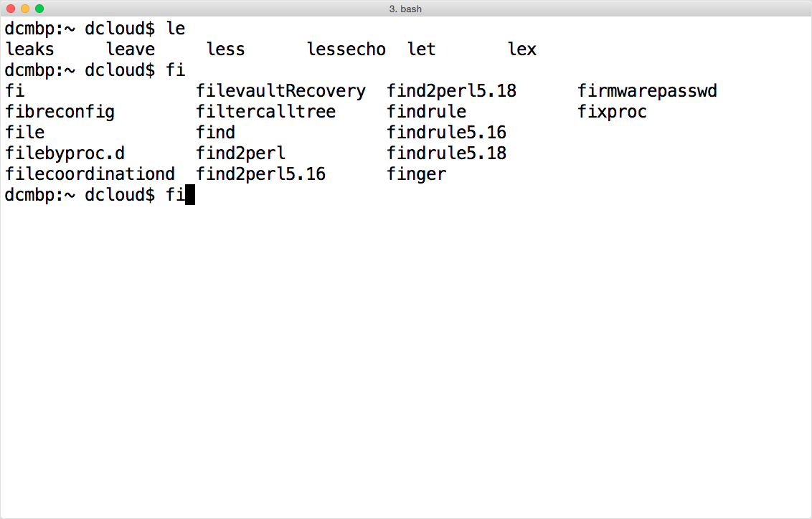

# Using the keyboard

The keyboard is essential to navigating and controlling the command line. In fact, your mouse or trackpad is probably of little use in the terminal. We'll go over some of basic keyboard shortcuts that get used frequently when navigating or running commands in the terminal. For a more comprehensive list, check out Wikipedia's [Bash article]("https://en.wikipedia.org/wiki/Bash_(Unix_shell)#Keyboard_shortcuts").

**Note:** There are some useful keyboard shortcuts bound to a key referred to as the *Meta* key, which is typically the <kbd>Option/Alt</kbd> key, but some terminal programs, such as the OS X Terminal, don't enable this by default. If <kbd>Option/Alt</kbd> shortcuts aren't working for you, you probably just need to enable the *Meta* key. On OS X, you can [find this setting](http://osxdaily.com/2013/02/01/use-option-as-meta-key-in-mac-os-x-terminal/) enable this under the settings for each profile's "keyboard" section.

## General keyboard shortcuts

| Shortcut | What it does |
| -------- | ------------ |
| <kbd>Ctrl+c</kbd> | Sends a signal telling the operating system to interrupt (stop and close) the current command (. Say you're running "grepping" (running the `grep` command to search) on a large file and you want it to stop. Press <kbd>Ctrl+c</kbd> to stop `grep` from running. |
| <kbd>Ctrl+d</kbd> | Similar to <kbd>Ctrl+c</kbd> in that its typical use is to cause something to quit, such as when running an interactive program such as the `python` interpreter. Also closes the current shell if no program is running. |
| <kbd>Tab</kbd> | Autocompletion in the terminal. Start typing and then hit <kbd>Tab</kbd> to see matching commands and files that match (from the beginning). You can discover a lot of commands this way! |
| <kbd>Ctrl+l</kbd> | Clears the screen (you can also use the `clear` command) |

### Tab completion example

## Keyboard shortcuts for moving the (text) cursor

In the terminal, there is a little block (or box or bar, any of which may be blinking) which typically sits at the end of the line you are typing on. This is your *cursor* (not to be confused with a mouse cursor). You can move that cursor around a line to edit what you've already typed.

| Shortcut | What it does |
| -------- | ------------ |
| <kbd>Ctrl+a</kbd> | Move the cursor to the beginning of the line. Useful when you've typed a command with long arguments and you realize there's a typo. You can also use the <kbd>Home</kbd> key. |
| <kbd>Ctrl+e</kbd> | Move the cursor to the end of the line. You can also use the <kbd>End</kbd> key. |
| <kbd>Ctrl+f</kbd> | Move the cursor **f**orward one character. You can also use the <kbd>&rarr;</kbd> (right arrow) key. |
| <kbd>Ctrl+b</kbd> | Move the cursor **b**ackward one character. You can also use the <kbd>&larr;</kbd> (right arrow) key. |
| <kbd>Option/Alt+f</kbd> | Move the cursor **f**orward one *word* (or word segment), using spaces and punctuation as word boundaries. |
| <kbd>Option/Alt+b</kbd> | Move the cursor **b**ackward one *word* (or word segment), using spaces and punctuation as word boundaries. |

## Keyboard shortcuts for navigating your command history

That's right, the things you've typed in the command line and run (typically) get saved to a history. You can use the up arrow to move backward in history, and (if you've moved back in the history) you can use the down arrow to move forward. You can also search your command history by pressing <kbd>Ctrl+r</kbd>, then typing some letters from a previously used line (the command or options or arguments). Pressing <kbd>Ctrl+r</kbd> again at this point will search further back in history. If you've found the command you want to run, you can press <kbd>Enter</kbd> to run it. You can also press <kbd>Tab</kbd> to select that command line and place the cursor at the end of the line *without* running it. If you just want to cancel your search, press <kbd>Ctrl+c</kbd>.

| Shortcut | What it does |
| -------- | ------------ |
| <kbd>Ctrl+r</kbd> | Initiate a search of your command history, from most recent backwards. |
| <kbd>Ctrl+s</kbd> | Search forward in your command history to more recent commands. Useful after <kbd>Ctrl+r</kbd> a few too many times. |
| <kbd>Ctrl+c</kbd> | Cancel your search. |

